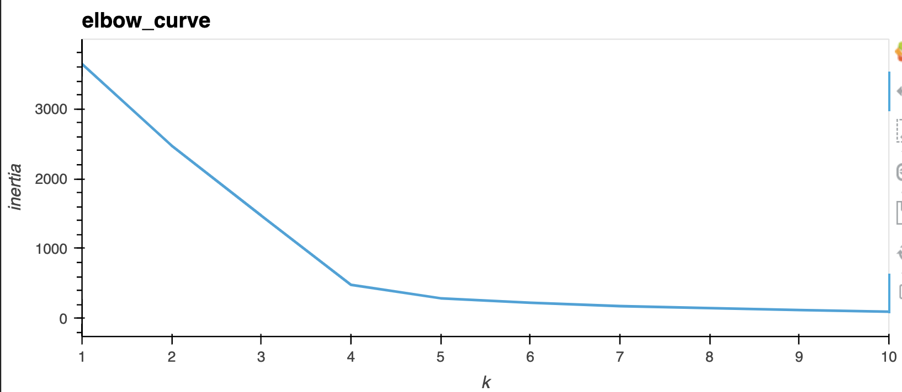
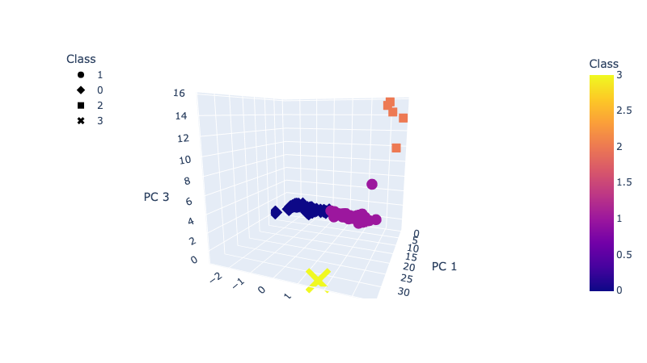
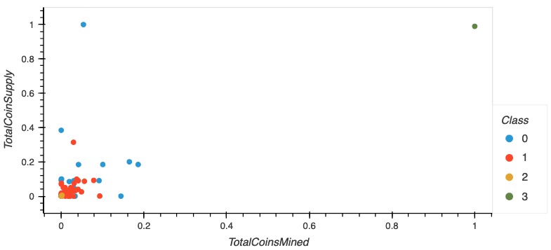
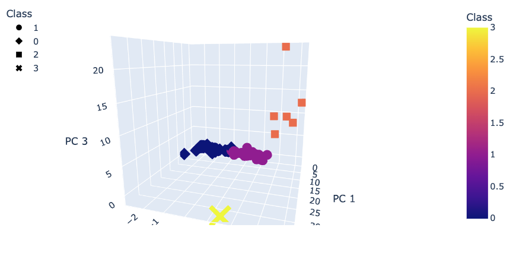
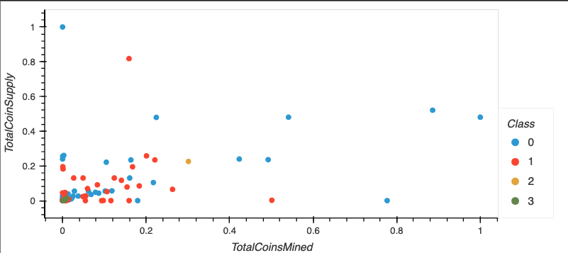

# Unsupervised Machine Learning:
## Clustering Cryptocurrencies to find patterns.  

This project primarily dealt with using the Pandas library in Python to perform Principal Component Analysis (PCA) on a dataset retrieved from [CryptoCompare](https://min-api.cryptocompare.com/data/all/coinlist).  Once the data was prepared, over 500 actively trading cryptocurrencies were fed into SciKit Learn’s unsupervised machine-learning algorithm to identify clusters based on total coins mined and total supply of coins, and visualize the results.

# Overview

Before starting the machine learning, the data needed to be cleaned and scaled to produce meaningful results from unsupervised machine learning.  This meant dropping all null values, transforming the algorithm names into numerical bins, and standardizing the data using the `StandardScaler` class. 

# Results

Based on the K-means ‘elbow curve’ test, a visual representation of the statistical analysis showing how many meaningful clusters a data set can be transformed into, it was determined that the data best fit into four clusters.

The data can be viewed in three dimensions using Plotly as shown here: 

The same data can be visualized as a scatterplot as well: 

# Summary

The results of the unsupervised machine learning clearly demonstrate that the crypt-currencies fall into discrete groups.  For future analysis, including feeding data into a supervised machine learning model to make predictions, there is a good case to make for removing the two outliers in the data to focus the clustering.  After removing the two outlier cryptocurrencies ‘BitTorrent’ and ‘TurtleCoin’ and re-running the analysis in the `2nd_pre-processesing` notebook, the following results were returned which appears much better suited for further analysis.

In three-deminsions, the clusterings remain failrly similar, 

But ploted in two-demensions the effects of removing the two outliers become much clearer:

